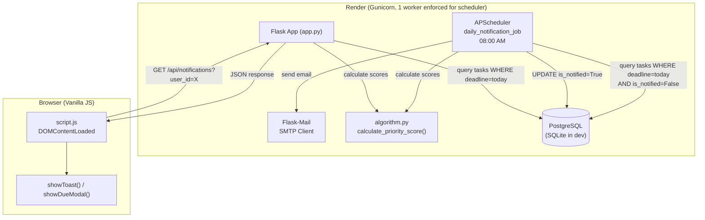
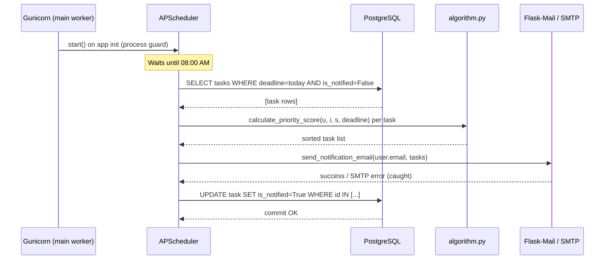
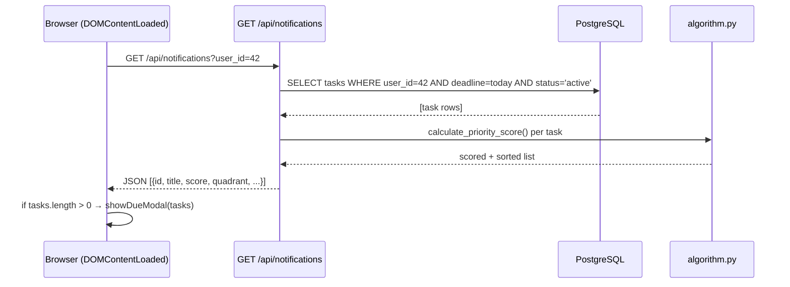

# Design Document: Due Date Notifications

## Overview

This feature adds automated daily email reminders and an in-app notification banner for tasks whose deadline falls on the current day. A Flask-APScheduler job fires at 08:00 AM each day, queries tasks due today that have not yet been notified, sends a priority-sorted email to each affected user via Flask-Mail, and marks those tasks `is_notified = True`. A new REST endpoint (`GET /api/notifications`) lets the frontend poll for today's due tasks on page load and display a toast/modal using the existing notification infrastructure.

The feature also migrates the priority-score formula from `script.js` into `algorithm.py` so the backend can sort tasks in the email body using the same weighted formula the frontend already uses, ensuring consistency across both surfaces.

---

## Architecture



---

## Sequence Diagrams

### Daily Scheduler Flow



### Frontend Notification Flow



---

## Components and Interfaces

### Component 1: `algorithm.py` — Priority Engine

**Purpose**: Single source of truth for the priority score formula, shared by the scheduler, the notifications API, and (via JS copy) the frontend.

**Interface**:
```python
def calculate_priority_score(
    urgency: int,          # 1–10
    importance: int,       # 1–10
    severity: int,         # 1–10
    deadline_str: str      # "YYYY-MM-DD" or "YYYY-MM-DDTHH:MM"
) -> dict:
    """
    Returns:
        {
            "score": float,          # raw weighted score
            "days_remaining": int,   # ceil of days until deadline
            "total_hours": float,    # fractional hours until deadline
            "normalized": float      # 1–10 scale
        }
    """

def get_eisenhower_quadrant(urgency: int, importance: int) -> str:
    """
    Returns one of: "Q1_DO_FIRST", "Q2_SCHEDULE", "Q3_DELEGATE", "Q4_ELIMINATE"
    Mirrors the JS thresholds: urgency >= 6 = urgent, importance >= 6 = important.
    """
```

**Responsibilities**:
- Implement `score = (0.3×U + 0.4×I + 0.3×S) × (1 + 2/(days_remaining + 1))`
- Normalize raw score to 1–10 scale (MAX_RAW = 30)
- Classify tasks into Eisenhower quadrants using the same thresholds as `script.js`
- Handle edge cases: past deadlines (days_remaining clamped to 0), invalid date strings

---

### Component 2: `scheduler.py` — Daily Notification Job

**Purpose**: Registers and runs the APScheduler background job. Includes a process guard to prevent duplicate execution under Gunicorn multi-worker deployments.

**Interface**:
```python
def init_scheduler(app: Flask) -> APScheduler:
    """
    Initialises and starts the APScheduler attached to the Flask app.
    Returns the scheduler instance (or None if process guard blocks startup).
    """

def daily_notification_job() -> None:
    """
    Scheduled job: runs at 08:00 AM daily.
    Finds tasks due today with is_notified=False, sends emails, marks notified.
    """
```

**Responsibilities**:
- Guard against multi-worker duplicate execution using `os.environ.get('SCHEDULER_RUNNING')` env flag or a file-lock strategy
- Push Flask app context before any DB/mail operations
- Catch all SMTP exceptions — log them, do not re-raise (app must not crash)
- Commit `is_notified = True` only after a successful email send (or always, depending on retry policy — see Error Handling)

---

### Component 3: `mail_service.py` — Email Renderer & Sender

**Purpose**: Constructs and sends the HTML notification email.

**Interface**:
```python
def send_notification_email(
    recipient_email: str,
    recipient_name: str,
    tasks: list[dict]       # sorted by priority score descending
) -> bool:
    """
    Sends a styled HTML email listing today's due tasks.
    Returns True on success, False on SMTP failure.
    """
```

**Responsibilities**:
- Build an HTML email body with task title, score, Eisenhower quadrant label, and deadline time
- Use Flask-Mail's `Message` object with both HTML and plain-text fallback
- Catch `smtplib.SMTPException` and all sub-exceptions; log and return `False`
- Never expose SMTP credentials in logs

---

### Component 4: `routes.py` — Notifications Endpoint

**Purpose**: Exposes today's due tasks for the authenticated user so the frontend can show an in-app banner.

**Interface**:
```
GET /api/notifications?user_id=<int>

Response 200:
[
  {
    "id": 7,
    "title": "Submit project report",
    "urgency": 8,
    "importance": 9,
    "severity": 7,
    "deadline": "2025-07-15T09:00",
    "score": 14.25,
    "normalized_score": 5.8,
    "quadrant": "Q1_DO_FIRST",
    "tags": [{"name": "Work", "color": "blue"}],
    "is_notified": true
  }
]

Response 400: {"error": "user_id required"}
Response 404: {"error": "User not found"}
```

---

### Component 5: `models.py` — Task Model Extension

**Purpose**: Adds the `is_notified` flag to the `Task` model.

**Interface**:
```python
class Task(db.Model):
    # ... existing fields ...
    is_notified = db.Column(db.Boolean, nullable=False, default=False)
```

**Migration**: Generated via `flask db migrate -m "add is_notified to task"` and applied with `flask db upgrade`. The manual `ALTER TABLE` hack in `app.py` is removed.

---

### Component 6: `script.js` — Frontend Notification UI

**Purpose**: On page load (dashboard only), fetches `/api/notifications` and shows a modal if tasks are due today.

**Interface**:
```javascript
async function checkDueNotifications(): Promise<void>
// Fetches /api/notifications, calls showDueModal() if tasks exist.

function showDueModal(tasks: Array): void
// Renders a modal overlay listing today's due tasks with quadrant badges.
// Reuses existing .modal-overlay / .modal-content CSS classes.
```

**Responsibilities**:
- Only run on the dashboard (`index.html`)
- Gracefully handle fetch errors (log, do not crash page)
- Reuse existing `showToast()` for a lightweight fallback if modal DOM is unavailable

---

## Data Models

### Extended Task Model

```python
class Task(db.Model):
    id              = db.Column(db.Integer, primary_key=True)
    title           = db.Column(db.Text, nullable=False)
    user_id         = db.Column(db.Integer, db.ForeignKey("user.id"), nullable=False)
    urgency         = db.Column(db.Integer, nullable=False, default=1)   # 1–10
    importance      = db.Column(db.Integer, nullable=False, default=1)   # 1–10
    severity        = db.Column(db.Integer, nullable=False, default=1)   # 1–10
    deadline        = db.Column(db.String(50), nullable=False)           # "YYYY-MM-DD" or "YYYY-MM-DDTHH:MM"
    duration_minutes= db.Column(db.Integer, nullable=True)
    status          = db.Column(db.String(20), nullable=False, default='active')
    tags            = db.Column(db.Text, nullable=True)                  # JSON string: [{"name":"Work","color":"blue"}]
    created_at      = db.Column(db.DateTime, default=datetime.utcnow)
    is_notified     = db.Column(db.Boolean, nullable=False, default=False)  # NEW
```

**Validation Rules**:
- `is_notified` defaults to `False` on task creation; only the scheduler sets it to `True`
- The API endpoint does not expose `is_notified` as a writable field (read-only from client perspective)
- Migration must handle existing rows: `ALTER TABLE task ADD COLUMN is_notified BOOLEAN NOT NULL DEFAULT FALSE`

### Notification Response DTO

```python
{
    "id":               int,
    "title":            str,
    "urgency":          int,        # 1–10
    "importance":       int,        # 1–10
    "severity":         int,        # 1–10
    "deadline":         str,        # original string value
    "score":            float,      # raw priority score
    "normalized_score": float,      # 1–10 normalized
    "quadrant":         str,        # "Q1_DO_FIRST" | "Q2_SCHEDULE" | "Q3_DELEGATE" | "Q4_ELIMINATE"
    "tags":             list[dict], # parsed from JSON string
    "is_notified":      bool
}
```

---

## Algorithmic Pseudocode

### Priority Score Algorithm

```pascal
ALGORITHM calculate_priority_score(urgency, importance, severity, deadline_str)
INPUT:
  urgency        : Integer [1..10]
  importance     : Integer [1..10]
  severity       : Integer [1..10]
  deadline_str   : String  ("YYYY-MM-DD" or "YYYY-MM-DDTHH:MM")
OUTPUT:
  result : { score: Float, days_remaining: Integer, total_hours: Float, normalized: Float }

CONSTANTS:
  W_U      ← 0.3
  W_I      ← 0.4
  W_S      ← 0.3
  ALPHA    ← 2
  MAX_RAW  ← 30

BEGIN
  // Parse deadline
  IF deadline_str contains 'T' THEN
    deadline ← parse_iso(deadline_str)
  ELSE
    deadline ← parse_date(deadline_str + 'T00:00:00')
  END IF

  IF deadline is invalid THEN
    RETURN { score: 0, days_remaining: 0, total_hours: 0, normalized: 1 }
  END IF

  // Compute time delta
  now            ← current_datetime()
  diff_seconds   ← (deadline - now).total_seconds()
  total_hours    ← diff_seconds / 3600
  days_remaining ← total_hours / 24

  // Clamp to avoid negative multiplier
  clamped_days ← MAX(0, days_remaining)

  // Weighted base score
  base_score ← (W_U × urgency) + (W_I × importance) + (W_S × severity)

  // Urgency multiplier (increases as deadline approaches)
  multiplier ← 1 + (ALPHA / (clamped_days + 1))

  // Final score
  score ← base_score × multiplier

  // Normalize to 1–10
  normalized ← CLAMP(1 + (score / MAX_RAW) × 9, 1, 10)

  RETURN {
    score          : ROUND(score, 2),
    days_remaining : CEIL(days_remaining),
    total_hours    : total_hours,
    normalized     : ROUND(normalized, 1)
  }
END
```

**Preconditions:**
- `urgency`, `importance`, `severity` are integers in [1, 10]
- `deadline_str` is a non-empty string

**Postconditions:**
- `score >= 0`
- `normalized` is in [1.0, 10.0]
- If deadline is in the past, `days_remaining <= 0` and `score` is at its maximum for the given U/I/S values

**Loop Invariants:** N/A (no loops)

---

### Daily Notification Job Algorithm

```pascal
ALGORITHM daily_notification_job()
INPUT:  none (reads from DB via app context)
OUTPUT: none (side effects: emails sent, DB updated)

BEGIN
  today_str ← current_date().isoformat()   // "YYYY-MM-DD"

  // Fetch all tasks due today that haven't been notified
  tasks_due ← SELECT task
               FROM   task
               WHERE  deadline LIKE (today_str + '%')
               AND    is_notified = FALSE
               AND    status = 'active'

  // Group by user
  user_task_map ← GROUP tasks_due BY task.user_id

  FOR EACH (user_id, user_tasks) IN user_task_map DO
    // LOOP INVARIANT: all previously processed users have been emailed
    //                 and their tasks marked is_notified=True (or skipped on error)

    user ← SELECT user WHERE id = user_id

    // Score and sort tasks for this user
    scored_tasks ← []
    FOR EACH task IN user_tasks DO
      result ← calculate_priority_score(task.urgency, task.importance,
                                        task.severity, task.deadline)
      task.score      ← result.score
      task.quadrant   ← get_eisenhower_quadrant(task.urgency, task.importance)
      scored_tasks.APPEND(task)
    END FOR

    scored_tasks.SORT BY score DESCENDING

    // Attempt email delivery
    success ← send_notification_email(user.email, user.name, scored_tasks)

    IF success THEN
      FOR EACH task IN user_tasks DO
        task.is_notified ← TRUE
      END FOR
      db.session.commit()
    ELSE
      LOG "Email failed for user_id=" + user_id + "; is_notified NOT updated"
      // Tasks remain is_notified=False → will retry next day's run
    END IF

  END FOR
END
```

**Preconditions:**
- Flask app context is active
- DB connection is available
- `MAIL_*` env vars are configured

**Postconditions:**
- For each successfully emailed user, all their tasks due today have `is_notified = True`
- For failed emails, tasks remain `is_notified = False` (natural retry on next run)
- No unhandled exceptions propagate out of this function

**Loop Invariants:**
- Outer loop: all previously processed users have had their email attempted and DB updated accordingly
- Inner scoring loop: `scored_tasks` contains only valid score dicts

---

## Key Functions with Formal Specifications

### `calculate_priority_score(urgency, importance, severity, deadline_str)`

```python
def calculate_priority_score(
    urgency: int, importance: int, severity: int, deadline_str: str
) -> dict
```

**Preconditions:**
- `1 <= urgency <= 10`
- `1 <= importance <= 10`
- `1 <= severity <= 10`
- `deadline_str` is a non-empty string parseable as `YYYY-MM-DD` or `YYYY-MM-DDTHH:MM`

**Postconditions:**
- Returns dict with keys: `score` (float ≥ 0), `days_remaining` (int), `total_hours` (float), `normalized` (float in [1.0, 10.0])
- `score` matches formula: `(0.3U + 0.4I + 0.3S) × (1 + 2/(max(0, days) + 1))`
- `normalized` is monotonically related to `score`
- Invalid `deadline_str` returns `{score: 0, days_remaining: 0, total_hours: 0, normalized: 1.0}`

---

### `get_eisenhower_quadrant(urgency, importance)`

```python
def get_eisenhower_quadrant(urgency: int, importance: int) -> str
```

**Preconditions:**
- `1 <= urgency <= 10`
- `1 <= importance <= 10`

**Postconditions:**
- Returns exactly one of: `"Q1_DO_FIRST"`, `"Q2_SCHEDULE"`, `"Q3_DELEGATE"`, `"Q4_ELIMINATE"`
- Thresholds mirror `script.js`: `urgency >= 6` → urgent; `importance >= 6` → important
- Result is deterministic for any given (urgency, importance) pair

---

### `send_notification_email(recipient_email, recipient_name, tasks)`

```python
def send_notification_email(
    recipient_email: str, recipient_name: str, tasks: list[dict]
) -> bool
```

**Preconditions:**
- `recipient_email` is a non-empty, syntactically valid email string
- `tasks` is a non-empty list of task dicts, each containing `title`, `score`, `quadrant`, `deadline`

**Postconditions:**
- Returns `True` if and only if the SMTP server accepted the message
- Returns `False` on any `smtplib.SMTPException` or connection error (never raises)
- No side effects on the `tasks` list

---

### `GET /api/notifications` handler

```python
def get_notifications() -> tuple[Response, int]
```

**Preconditions:**
- `user_id` query parameter is present and castable to `int`
- User with that ID exists in the DB

**Postconditions:**
- Returns HTTP 200 with a JSON array (may be empty) of today's active tasks for the user
- Each item includes `score`, `normalized_score`, `quadrant`, and `is_notified`
- Returns HTTP 400 if `user_id` is missing
- Returns HTTP 404 if user does not exist
- Never returns tasks belonging to a different user

---

## Example Usage

### Backend: Priority Score

```python
from algorithm import calculate_priority_score, get_eisenhower_quadrant

result = calculate_priority_score(
    urgency=8, importance=9, severity=7,
    deadline_str="2025-07-15T09:00"
)
# result = {"score": 14.25, "days_remaining": 0, "total_hours": 1.5, "normalized": 5.3}

quadrant = get_eisenhower_quadrant(urgency=8, importance=9)
# quadrant = "Q1_DO_FIRST"
```

### Backend: Sending a Notification Email

```python
from mail_service import send_notification_email

tasks = [
    {"title": "Submit report", "score": 14.25, "quadrant": "Q1_DO_FIRST", "deadline": "2025-07-15T09:00"},
    {"title": "Review PR",     "score": 8.10,  "quadrant": "Q2_SCHEDULE",  "deadline": "2025-07-15T17:00"},
]
success = send_notification_email("alice@example.com", "Alice", tasks)
# success = True
```

### Frontend: Fetching and Displaying Notifications

```javascript
// On DOMContentLoaded (dashboard only)
async function checkDueNotifications() {
    try {
        const res = await fetch(`/api/notifications?user_id=${getUserId()}`);
        if (!res.ok) return;
        const tasks = await res.json();
        if (tasks.length > 0) {
            showDueModal(tasks);
        }
    } catch (err) {
        console.warn('Notification check failed:', err);
    }
}

// Modal renders task list with quadrant badges
function showDueModal(tasks) {
    // Reuses existing .modal-overlay CSS
    // Shows: "You have X tasks due today!"
    // Lists each task with title, quadrant badge, normalized score
}
```

### Scheduler Registration in `app.py`

```python
from scheduler import init_scheduler

def create_app(config_override=None):
    app = Flask(__name__)
    # ... existing config ...
    db.init_app(app)
    migrate.init_app(app, db)
    mail.init_app(app)          # NEW
    init_scheduler(app)         # NEW — process-guarded
    app.register_blueprint(bp)
    return app
```

---

## Correctness Properties

1. **Score consistency**: For any task, `calculate_priority_score()` in Python and `calculatePriorityScore()` in JavaScript must return the same `score` value (within floating-point tolerance) given identical inputs.

2. **Quadrant consistency**: `get_eisenhower_quadrant()` in Python must return the same quadrant classification as the inline logic in `renderSchedule()` in `script.js` for all (urgency, importance) pairs.

3. **No double-notification**: A task with `is_notified = True` must never appear in the scheduler's query result, ensuring each task generates at most one email per deadline day.

4. **Notification idempotency**: Running `daily_notification_job()` twice on the same day must not send duplicate emails (guaranteed by the `is_notified` flag).

5. **User isolation**: `GET /api/notifications?user_id=X` must never return tasks belonging to a user other than X.

6. **Graceful SMTP failure**: If `send_notification_email()` raises or returns `False`, the scheduler must not commit `is_notified = True` for that user's tasks, and the app process must remain running.

7. **Score monotonicity**: For fixed U/I/S, as `days_remaining` decreases toward 0, `score` must increase monotonically.

8. **Normalization bounds**: `normalized` must always satisfy `1.0 <= normalized <= 10.0` regardless of input values.

---

## Error Handling

### SMTP Connection Failure

**Condition**: `MAIL_SERVER` is unreachable or credentials are wrong at job execution time.
**Response**: `send_notification_email()` catches the exception, logs `"SMTP error for {email}: {exc}"`, returns `False`. Scheduler skips the `is_notified = True` commit for that user.
**Recovery**: Tasks remain `is_notified = False`; the next day's job will retry. No app crash.

### Missing Mail Environment Variables

**Condition**: `MAIL_SERVER`, `MAIL_USERNAME`, or `MAIL_PASSWORD` are not set on Render.
**Response**: Flask-Mail raises `ConnectionRefusedError` on first send attempt. Caught by `send_notification_email()`.
**Recovery**: Log a clear warning at app startup if mail config is incomplete. Scheduler job runs but skips sending.

### Gunicorn Multi-Worker Duplicate Scheduler

**Condition**: Gunicorn spawns multiple worker processes; each would start its own APScheduler instance.
**Response**: Use `os.environ.setdefault('SCHEDULER_RUNNING', '1')` — only the first process to set this flag starts the scheduler. Alternatively, check `os.getpid() == os.getppid() + 1` or use a file lock at `/tmp/scheduler.lock`.
**Recovery**: Only one scheduler instance runs; other workers skip `init_scheduler()`.

### Invalid Deadline String in Score Calculation

**Condition**: A task's `deadline` field contains a malformed string.
**Response**: `calculate_priority_score()` catches `ValueError` from date parsing, returns `{score: 0, days_remaining: 0, total_hours: 0, normalized: 1.0}`.
**Recovery**: Task appears at the bottom of sorted lists; no crash.

### Frontend Fetch Failure

**Condition**: `/api/notifications` returns a non-200 status or network error.
**Response**: `checkDueNotifications()` catches the error, logs a warning, and returns without showing any UI.
**Recovery**: Page loads normally; user sees no notification (silent degradation).

---

## Testing Strategy

### Unit Testing Approach

Since no test framework currently exists, set up **pytest** as the standard choice for Flask/Python projects.

Key unit test cases:
- `calculate_priority_score()` with known inputs → verify exact score and normalized values
- `calculate_priority_score()` with past deadline → verify `days_remaining <= 0` and score is maximum for given U/I/S
- `calculate_priority_score()` with invalid deadline string → verify safe fallback return
- `get_eisenhower_quadrant()` for all four quadrant boundary combinations
- `send_notification_email()` with a mocked SMTP server → verify `True` return
- `send_notification_email()` with SMTP exception → verify `False` return and no re-raise
- `GET /api/notifications` with valid `user_id` → verify correct task list and DTO shape
- `GET /api/notifications` with missing `user_id` → verify 400 response
- `daily_notification_job()` with mocked mail → verify `is_notified` is set to `True` after success
- `daily_notification_job()` with failed mail → verify `is_notified` remains `False`

### Property-Based Testing Approach

**Property Test Library**: `hypothesis`

Properties to test:
- For all valid (U, I, S) in [1,10]³ and any future deadline: `1.0 <= normalized <= 10.0`
- For all valid (U, I, S) and fixed deadline: score is monotonically non-decreasing as days_remaining decreases
- For all (urgency, importance) in [1,10]²: `get_eisenhower_quadrant()` returns one of exactly four valid strings
- For any user_id, the notifications endpoint never returns tasks with a different `user_id`

### Integration Testing Approach

- Scheduler job integration: use an in-memory SQLite DB, seed tasks due today, run `daily_notification_job()` with mocked Flask-Mail, assert `is_notified = True` and email was called once per user
- Migration test: apply migration on a fresh SQLite DB, verify `is_notified` column exists with default `False`

---

## Performance Considerations

- The scheduler query uses `deadline LIKE 'YYYY-MM-DD%'` on a `String(50)` column. For the current scale (single-user app on Render free tier), this is acceptable. If the user base grows, add a DB index on `(deadline, is_notified, status)`.
- The notifications API endpoint is called once per page load on the dashboard. Response time is bounded by a single filtered DB query + O(n) score calculations, both negligible at this scale.
- Flask-Mail sends emails synchronously within the scheduler job. For large user counts, this should be moved to a task queue (Celery/Redis), but is out of scope for this feature.

---

## Security Considerations

- SMTP credentials (`MAIL_USERNAME`, `MAIL_PASSWORD`) must only be set as Render environment variables, never committed to source control.
- The `/api/notifications` endpoint currently uses `user_id` as a query parameter without session-based auth verification (consistent with the existing `/api/tasks` pattern). This is acceptable for the current Google OAuth flow where `user_id` is stored in `localStorage`, but should be hardened with server-side session validation in a future auth improvement.
- Email content must not include raw user-supplied data without escaping to prevent HTML injection in the email body.
- SMTP errors must never be surfaced to the client response — only logged server-side.

---

## Dependencies

New packages to add to `requirements.txt`:

| Package | Version | Purpose |
|---|---|---|
| `Flask-Mail` | `0.10.0` | SMTP email sending |
| `Flask-APScheduler` | `1.13.1` | Background job scheduling |

New environment variables to configure on Render:

| Variable | Example Value | Notes |
|---|---|---|
| `MAIL_SERVER` | `smtp.gmail.com` | SMTP host |
| `MAIL_PORT` | `587` | TLS port |
| `MAIL_USE_TLS` | `true` | Enable STARTTLS |
| `MAIL_USERNAME` | `noreply@example.com` | Sender account |
| `MAIL_PASSWORD` | `app-specific-password` | Never commit to git |
| `MAIL_DEFAULT_SENDER` | `noreply@example.com` | From address in emails |

Files to create or modify:

| File | Action |
|---|---|
| `src/algorithm.py` | Implement `calculate_priority_score()` and `get_eisenhower_quadrant()` |
| `src/scheduler.py` | New file — APScheduler setup and daily job |
| `src/mail_service.py` | New file — email construction and sending |
| `src/extensions.py` | Add `Mail` instance |
| `src/models.py` | Add `is_notified` column to `Task` |
| `src/app.py` | Remove manual ALTER TABLE hack; init mail + scheduler |
| `src/routes.py` | Add `GET /api/notifications` endpoint |
| `src/static/script.js` | Add `checkDueNotifications()` and `showDueModal()` |
| `src/requirements.txt` | Add `Flask-Mail==0.10.0`, `Flask-APScheduler==1.13.1` |
| `render.yaml` | Add new env var keys |
